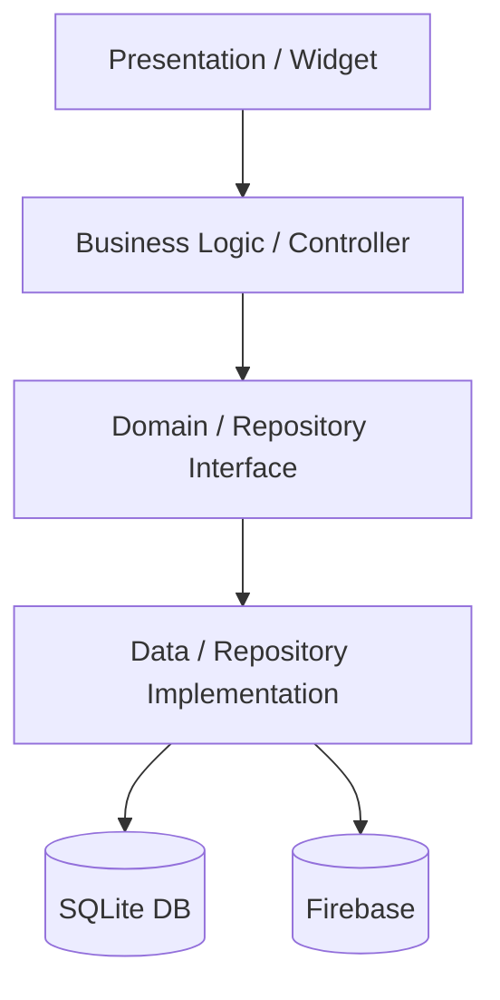

# ⚙️ Architecture Overview

Employee Connect is built using **Clean Architecture** principles, ensuring a strict separation of concerns and high testability.

## 🏗 Layered Structure

The project is organized into four main layers:

### 1. Core
Contains application-wide constants, global utilities, theme definitions, and the service locator configuration (`get_it`).
- [app_routes.dart](file:///c:/Projects/Mobile%20App%20Developement/Flutter/Employee%20Connect/Employee%20Connect-Employee%20and%20Employee%20Family%20Management%20System-%20Flutter%20Mobile%20App/lib/core/constants/app_routes.dart)
- [service_locator.dart](file:///c:/Projects/Mobile%20App%20Developement/Flutter/Employee%20Connect/Employee%20Connect-Employee%20and%20Employee%20Family%20Management%20System-%20Flutter%20Mobile%20App/lib/core/service_locator.dart)

### 2. Domain
The heart of the application. Contains **Entities** and **Repository Interfaces**. This layer is independent of any external libraries or frameworks.
- [family_member.dart](file:///c:/Projects/Mobile%20App%20Developement/Flutter/Employee%20Connect/Employee%20Connect-Employee%20and%20Employee%20Family%20Management%20System-%20Flutter%20Mobile%20App/lib/domain/entities/family_member.dart)

### 3. Data
Implements the repositories defined in the Domain layer. It handles data retrieval from **Local Sources (SQLite)** and **Remote Sources (Firebase)**.
- [database_helper.dart](file:///c:/Projects/Mobile%20App%20Developement/Flutter/Employee%20Connect/Employee%20Connect-Employee%20and%20Employee%20Family%20Management%20System-%20Flutter%20Mobile%20App/lib/data/datasources/local/database_helper.dart)
- [license_service.dart](file:///c:/Projects/Mobile%20App%20Developement/Flutter/Employee%20Connect/Employee%20Connect-Employee%20and%20Employee%20Family%20Management%20System-%20Flutter%20Mobile%20App/lib/data/services/license_service.dart)

### 4. Presentation
Handles the UI and state management. Screens are organized by feature area (auth, family, reports, settings).
- [family_member_form_page.dart](file:///c:/Projects/Mobile%20App%20Developement/Flutter/Employee%20Connect/Employee%20Connect-Employee%20and%20Employee%20Family%20Management%20System-%20Flutter%20Mobile%20App/lib/presentation/pages/family/family_member_form_page.dart)

## 🔄 Data Flow (Mermaid)

## 💉 Dependency Injection
The app uses `get_it` for dependency injection, centralizing the instantiation of services and repositories in `core/service_locator.dart`.
